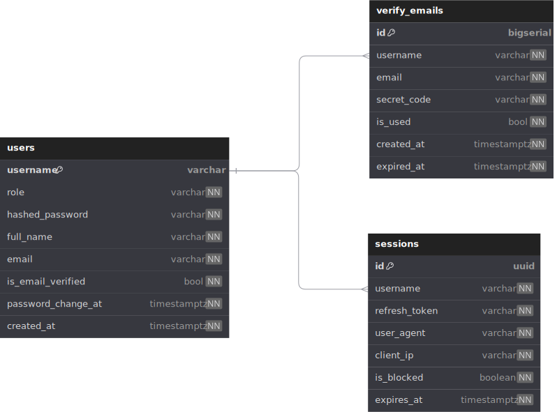

<p align="left"><h1 align="left">Authentication service</h1></p>

- Supports **HTTP/2** and **gRPC** protocols.
- PostgreSQL database with **sqlc** for type-safe queries.
- Redis queue for background tasks.


<div style="width: 900px">

</div>


## 🔗 Table of Contents

- [📍 Overview](#-overview)
- [👾 Features](#-features)
- [📁 Project Structure](#-project-structure)
    - [📂 Project Index](#-project-index)
- [🚀 Getting Started](#-getting-started)
    - [☑️ Prerequisites](#-prerequisites)
    - [⚙️ Installation](#-installation)
    - [🤖 Usage](#🤖-usage)
    - [🧪 Testing](#🧪-testing)
- [📌 Project Roadmap](#-project-roadmap)
- [🔰 Contributing](#-contributing)
- [🎗 License](#-license)
- [🙌 Acknowledgments](#-acknowledgments)

---

## 📍 Overview

A Golang authentication service API, supporting both HTTP/2 and gRPC protocols.
The service is designed to provide user authentication and authorization features,
including user registration, login, and email verification.
The service is built
using a PostgreSQL database with sqlc for type-safe queries and a Redis queue for background tasks. 

---

## 👾 Features

- **User Registration**: Register a new user with a unique email, username, and password.
- **Email Verification**: Sends a verification email to a user's email address. **User creation will rollback if verification email fails to send (using transactional queries with callbacks)**
- **User Login**: Authenticate a user with a valid email and password.
- **User Update**: Update a user's profile information, including their email, username, and password.


---

## 📁 Project Structure

```sh
└── auth/
    ├── db
    │   ├── migration
    │   ├── query
    │   └── sqlc
    ├── doc
    │   ├── db.dbml
    │   ├── statik
    │   └── swagger
    ├── gapi
    │   ├── authorization.go
    │   ├── converter.go
    │   ├── error.go
    │   ├── logger.go
    │   ├── metadata.go
    │   ├── rpc_create_user.go
    │   ├── rpc_login_user.go
    │   ├── rpc_update_user.go
    │   ├── rpc_verify_email.go
    │   └── server.go
    ├── go.mod
    ├── go.sum
    ├── main.go
    ├── makefile
    ├── pb
    │   ├── rpc_create_user.pb.go
    │   ├── rpc_login_user.pb.go
    │   ├── rpc_update_user.pb.go
    │   ├── rpc_verify_email.pb.go
    │   ├── service_auth.pb.go
    │   ├── service_auth.pb.gw.go
    │   ├── service_auth_grpc.pb.go
    │   └── user.pb.go
    ├── proto
    │   ├── google
    │   ├── protoc-gen-openapiv2
    │   ├── rpc_create_user.proto
    │   ├── rpc_login_user.proto
    │   ├── rpc_update_user.proto
    │   ├── rpc_verify_email.proto
    │   ├── service_auth.proto
    │   └── user.proto
    ├── sqlc.yaml
    ├── util
    │   ├── config.go
    │   ├── password.go
    │   └── random.go
    ├── val
    │   └── validator.go
    └── worker
        ├── distributor.go
        ├── logger.go
        ├── processor.go
        └── task_send_verify_email.go
```


### 📂 Project Index
<details open>
	<summary><b><code>AUTH/</code></b></summary>
	<details> <!-- __root__ Submodule -->
		<summary><b>__root__</b></summary>
		<blockquote>
			<table>
			<tr>
				<td><b><a href='https://github.com/fsobh/auth/blob/master/makefile'>makefile</a></b></td>
				<td><code>❯ makefile with commands for local development</code></td>
			</tr>
			<tr>
				<td><b><a href='https://github.com/fsobh/auth/blob/master/main.go'>main.go</a></b></td>
				<td><code>❯ Main entry point for API service</code></td>
			</tr>
			<tr>
				<td><b><a href='https://github.com/fsobh/auth/blob/master/go.mod'>go.mod</a></b></td>
				<td><code>❯ Go mod file</code></td>
			</tr>
			<tr>
				<td><b><a href='https://github.com/fsobh/auth/blob/master/go.sum'>go.sum</a></b></td>
				<td><code>❯ Go sum file</code></td>
			</tr>
			<tr>
				<td><b><a href='https://github.com/fsobh/auth/blob/master/sqlc.yaml'>sqlc.yaml</a></b></td>
				<td><code>❯ Sqlc V2 configuration file</code></td>
			</tr>
			</table>
		</blockquote>
	</details>
	<details> <!-- worker Submodule -->
		<summary><b>worker</b></summary>
		<blockquote>
			<table>
			<tr>
				<td><b><a href='https://github.com/fsobh/auth/blob/master/worker/processor.go'>processor.go</a></b></td>
				<td><code>❯ Task processor for Redis queue - picks up tasks from the queue to process and run them</code></td>
			</tr>
			<tr>
				<td><b><a href='https://github.com/fsobh/auth/blob/master/worker/task_send_verify_email.go'>task_send_verify_email.go</a></b></td>
				<td><code>❯ Redis queue task for sending out the verification email to new users</code></td>
			</tr>
			<tr>
				<td><b><a href='https://github.com/fsobh/auth/blob/master/worker/logger.go'>logger.go</a></b></td>
				<td><code>❯ Logger for the Redis queue</code></td>
			</tr>
			<tr>
				<td><b><a href='https://github.com/fsobh/auth/blob/master/worker/distributor.go'>distributor.go</a></b></td>
				<td><code>❯ Redis task distributor interface - distributes the tasks into appropriate queues</code></td>
			</tr>
			</table>
		</blockquote>
	</details>
	<details> <!-- proto Submodule -->
		<summary><b>proto</b></summary>
		<blockquote>
			<table>
			<tr>
				<td><b><a href='https://github.com/fsobh/auth/blob/master/proto/user.proto'>user.proto</a></b></td>
				<td><code>❯ proto buff specification for `User` object serialization</code></td>
			</tr>
			<tr>
				<td><b><a href='https://github.com/fsobh/auth/blob/master/proto/rpc_update_user.proto'>rpc_update_user.proto</a></b></td>
				<td><code>❯ proto buff specification for `Update user` request / response serialization</code></td>
			</tr>
			<tr>
				<td><b><a href='https://github.com/fsobh/auth/blob/master/proto/rpc_create_user.proto'>rpc_create_user.proto</a></b></td>
				<td><code>❯ proto buff specification for `Create user` request / response serialization</code></td>
			</tr>
			<tr>
				<td><b><a href='https://github.com/fsobh/auth/blob/master/proto/service_auth.proto'>service_auth.proto</a></b></td>
				<td><code>❯ proto buff specification for API service </code></td>
			</tr>
			<tr>
				<td><b><a href='https://github.com/fsobh/auth/blob/master/proto/rpc_verify_email.proto'>rpc_verify_email.proto</a></b></td>
				<td><code>❯ proto buff specification for `Verify email` request / response serialization</code></td>
			</tr>
			<tr>
				<td><b><a href='https://github.com/fsobh/auth/blob/master/proto/rpc_login_user.proto'>rpc_login_user.proto</a></b></td>
				<td><code>❯ proto buff specification for `Login user` request / response serialization</code></td>
			</tr>
			</table>
			<details>
				<summary><b>protoc-gen-openapiv2</b></summary>
				<blockquote>
					<details>
						<summary><b>options</b></summary>
						<blockquote>
							<table>
							<tr>
								<td><b><a href='https://github.com/fsobh/auth/blob/master/proto/protoc-gen-openapiv2/options/openapiv2.proto'>openapiv2.proto</a></b></td>
								<td><code>❯ REPLACE-ME</code></td>
							</tr>
							<tr>
								<td><b><a href='https://github.com/fsobh/auth/blob/master/proto/protoc-gen-openapiv2/options/annotations.proto'>annotations.proto</a></b></td>
								<td><code>❯ REPLACE-ME</code></td>
							</tr>
							</table>
						</blockquote>
					</details>
				</blockquote>
			</details>
			<details>
				<summary><b>google</b></summary>
				<blockquote>
					<details>
						<summary><b>api</b></summary>
						<blockquote>
							<table>
							<tr>
								<td><b><a href='https://github.com/fsobh/auth/blob/master/proto/google/api/httpbody.proto'>httpbody.proto</a></b></td>
								<td><code>❯ REPLACE-ME</code></td>
							</tr>
							<tr>
								<td><b><a href='https://github.com/fsobh/auth/blob/master/proto/google/api/field_behavior.proto'>field_behavior.proto</a></b></td>
								<td><code>❯ REPLACE-ME</code></td>
							</tr>
							<tr>
								<td><b><a href='https://github.com/fsobh/auth/blob/master/proto/google/api/http.proto'>http.proto</a></b></td>
								<td><code>❯ REPLACE-ME</code></td>
							</tr>
							<tr>
								<td><b><a href='https://github.com/fsobh/auth/blob/master/proto/google/api/annotations.proto'>annotations.proto</a></b></td>
								<td><code>❯ REPLACE-ME</code></td>
							</tr>
							</table>
						</blockquote>
					</details>
				</blockquote>
			</details>
		</blockquote>
	</details>
	<details> <!-- doc Submodule -->
		<summary><b>doc</b></summary>
		<blockquote>
			<table>
			<tr>
				<td><b><a href='https://github.com/fsobh/auth/blob/master/doc/db.dbml'>db.dbml</a></b></td>
				<td><code>❯ Database markup version of the database schema</code></td>
			</tr>
			</table>
			<details>
				<summary><b>statik</b></summary>
				<blockquote>
					<table>
					<tr>
						<td><b><a href='https://github.com/fsobh/auth/blob/master/doc/statik/statik.go'>statik.go</a></b></td>
						<td><code>❯ Serves static swagger specification page</code></td>
					</tr>
					</table>
				</blockquote>
			</details>
			<details>
				<summary><b>swagger</b></summary>
				<blockquote>
					<table>
					<tr>
						<td><b><a href='https://github.com/fsobh/auth/blob/master/doc/swagger/swagger-initializer.js'>swagger-initializer.js</a></b></td>
						<td><code>❯ cloned from <a href="https://github.com/swagger-api/swagger-ui/tree/master/dist">swagger-ui</a></code></td>
					</tr>
					<tr>
						<td><b><a href='https://github.com/fsobh/auth/blob/master/doc/swagger/swagger-ui-standalone-preset.js'>swagger-ui-standalone-preset.js</a></b></td>
						<td><code>❯ cloned from <a href="https://github.com/swagger-api/swagger-ui/tree/master/dist">swagger-ui</a></code></td>
					</tr>
					<tr>
						<td><b><a href='https://github.com/fsobh/auth/blob/master/doc/swagger/auth.swagger.json'>auth.swagger.json</a></b></td>
						<td><code>❯ cloned from <a href="https://github.com/swagger-api/swagger-ui/tree/master/dist">swagger-ui</a></code></td>
					</tr>
					<tr>
						<td><b><a href='https://github.com/fsobh/auth/blob/master/doc/swagger/swagger-ui-es-bundle.js'>swagger-ui-es-bundle.js</a></b></td>
						<td><code>❯ cloned from <a href="https://github.com/swagger-api/swagger-ui/tree/master/dist">swagger-ui</a></code></td>
					</tr>
					<tr>
						<td><b><a href='https://github.com/fsobh/auth/blob/master/doc/swagger/swagger-ui-bundle.js'>swagger-ui-bundle.js</a></b></td>
						<td><code>❯ cloned from <a href="https://github.com/swagger-api/swagger-ui/tree/master/dist">swagger-ui</a></code></td>
					</tr>
					<tr>
						<td><b><a href='https://github.com/fsobh/auth/blob/master/doc/swagger/index.css'>index.css</a></b></td>
						<td><code>❯ cloned from <a href="https://github.com/swagger-api/swagger-ui/tree/master/dist">swagger-ui</a></code></td>
					</tr>
					<tr>
						<td><b><a href='https://github.com/fsobh/auth/blob/master/doc/swagger/swagger-ui-es-bundle-core.js'>swagger-ui-es-bundle-core.js</a></b></td>
						<td><code>❯ cloned from <a href="https://github.com/swagger-api/swagger-ui/tree/master/dist">swagger-ui</a></code></td>
					</tr>
					<tr>
						<td><b><a href='https://github.com/fsobh/auth/blob/master/doc/swagger/swagger-ui.js'>swagger-ui.js</a></b></td>
						<td><code>❯ cloned from <a href="https://github.com/swagger-api/swagger-ui/tree/master/dist">swagger-ui</a></code></td>
					</tr>
					<tr>
						<td><b><a href='https://github.com/fsobh/auth/blob/master/doc/swagger/swagger-ui.css'>swagger-ui.css</a></b></td>
						<td><code>❯ cloned from <a href="https://github.com/swagger-api/swagger-ui/tree/master/dist">swagger-ui</a></code></td>
					</tr>
					<tr>
						<td><b><a href='https://github.com/fsobh/auth/blob/master/doc/swagger/index.html'>index.html</a></b></td>
						<td><code>❯ cloned from <a href="https://github.com/swagger-api/swagger-ui/tree/master/dist">swagger-ui</a></code></td>
					</tr>
					<tr>
						<td><b><a href='https://github.com/fsobh/auth/blob/master/doc/swagger/oauth2-redirect.html'>oauth2-redirect.html</a></b></td>
						<td><code>❯ cloned from <a href="https://github.com/swagger-api/swagger-ui/tree/master/dist">swagger-ui</a></code></td>
					</tr>
					</table>
				</blockquote>
			</details>
		</blockquote>
	</details>
	<details> <!-- gapi Submodule -->
		<summary><b>gapi</b></summary>
		<blockquote>
			<table>
			<tr>
				<td><b><a href='https://github.com/fsobh/auth/blob/master/gapi/metadata.go'>metadata.go</a></b></td>
				<td><code>❯ Helper to capture metadata of gRPC gateway requests</code></td>
			</tr>
			<tr>
				<td><b><a href='https://github.com/fsobh/auth/blob/master/gapi/logger.go'>logger.go</a></b></td>
				<td><code>❯ Logger file for gRPC & HTTP requests</code></td>
			</tr>
			<tr>
				<td><b><a href='https://github.com/fsobh/auth/blob/master/gapi/authorization.go'>authorization.go</a></b></td>
				<td><code>❯ Validates token format for incoming authorized calls</code></td>
			</tr>
			<tr>
				<td><b><a href='https://github.com/fsobh/auth/blob/master/gapi/rpc_update_user.go'>rpc_update_user.go</a></b></td>
				<td><code>❯ Function that is called to update a user record when the api endpoint is invoked </code></td>
			</tr>
			<tr>
				<td><b><a href='https://github.com/fsobh/auth/blob/master/gapi/rpc_verify_email.go'>rpc_verify_email.go</a></b></td>
				<td><code>❯ Function that is called to verify a new users email when the api endpoint is invoked</code></td>
			</tr>
			<tr>
				<td><b><a href='https://github.com/fsobh/auth/blob/master/gapi/error.go'>error.go</a></b></td>
				<td><code>❯ Helper to handle generic errors (invalid request params, unauthorized calls)</code></td>
			</tr>
			<tr>
				<td><b><a href='https://github.com/fsobh/auth/blob/master/gapi/rpc_login_user.go'>rpc_login_user.go</a></b></td>
				<td><code>❯ Function that is called to log a user into their account when the api endpoint is invoked</code></td>
			</tr>
			<tr>
				<td><b><a href='https://github.com/fsobh/auth/blob/master/gapi/converter.go'>converter.go</a></b></td>
				<td><code>❯ Helper to sanitize User database objects from sensitive data (like password)</code></td>
			</tr>
			<tr>
				<td><b><a href='https://github.com/fsobh/auth/blob/master/gapi/rpc_create_user.go'>rpc_create_user.go</a></b></td>
				<td><code>❯ Function that is called to create a new user account when the api endpoint is invoked</code></td>
			</tr>
			<tr>
				<td><b><a href='https://github.com/fsobh/auth/blob/master/gapi/server.go'>server.go</a></b></td>
				<td><code>❯ Initializes a new Server to run</code></td>
			</tr>
			</table>
		</blockquote>
	</details>
	<details> <!-- val Submodule -->
		<summary><b>val</b></summary>
		<blockquote>
			<table>
			<tr>
				<td><b><a href='https://github.com/fsobh/auth/blob/master/val/validator.go'>validator.go</a></b></td>
				<td><code>❯ Helper to validate string format for email, names, passwords, etc... </code></td>
			</tr>
			</table>
		</blockquote>
	</details>
	<details> <!-- pb Submodule -->
		<summary><b>pb</b></summary>
		<blockquote>
			<table>
			<tr>
				<td><b><a href='https://github.com/fsobh/auth/blob/master/pb/user.pb.go'>user.pb.go</a></b></td>
				<td><code>❯ Code generated by protoc-gen-go</code></td>
			</tr>
			<tr>
				<td><b><a href='https://github.com/fsobh/auth/blob/master/pb/service_auth_grpc.pb.go'>service_auth_grpc.pb.go</a></b></td>
				<td><code>❯ Code generated by protoc-gen-go</code></td>
			</tr>
			<tr>
				<td><b><a href='https://github.com/fsobh/auth/blob/master/pb/rpc_login_user.pb.go'>rpc_login_user.pb.go</a></b></td>
				<td><code>❯ Code generated by protoc-gen-go</code></td>
			</tr>
			<tr>
				<td><b><a href='https://github.com/fsobh/auth/blob/master/pb/rpc_update_user.pb.go'>rpc_update_user.pb.go</a></b></td>
				<td><code>❯ Code generated by protoc-gen-go</code></td>
			</tr>
			<tr>
				<td><b><a href='https://github.com/fsobh/auth/blob/master/pb/rpc_create_user.pb.go'>rpc_create_user.pb.go</a></b></td>
				<td><code>❯ Code generated by protoc-gen-go</code></td>
			</tr>
			<tr>
				<td><b><a href='https://github.com/fsobh/auth/blob/master/pb/service_auth.pb.go'>service_auth.pb.go</a></b></td>
				<td><code>❯ Code generated by protoc-gen-go</code></td>
			</tr>
			<tr>
				<td><b><a href='https://github.com/fsobh/auth/blob/master/pb/service_auth.pb.gw.go'>service_auth.pb.gw.go</a></b></td>
				<td><code>❯ Code generated by protoc-gen-go</code></td>
			</tr>
			<tr>
				<td><b><a href='https://github.com/fsobh/auth/blob/master/pb/rpc_verify_email.pb.go'>rpc_verify_email.pb.go</a></b></td>
				<td><code>❯ Code generated by protoc-gen-go</code></td>
			</tr>
			</table>
		</blockquote>
	</details>
	<details> <!-- util Submodule -->
		<summary><b>util</b></summary>
		<blockquote>
			<table>
			<tr>
				<td><b><a href='https://github.com/fsobh/auth/blob/master/util/password.go'>password.go</a></b></td>
				<td><code>❯ Helper to hash & compare passwords</code></td>
			</tr>
			<tr>
				<td><b><a href='https://github.com/fsobh/auth/blob/master/util/config.go'>config.go</a></b></td>
				<td><code>❯ Server configs read from app.env</code></td>
			</tr>
			<tr>
				<td><b><a href='https://github.com/fsobh/auth/blob/master/util/random.go'>random.go</a></b></td>
				<td><code>❯ Random generator utility</code></td>
			</tr>
			</table>
		</blockquote>
	</details>
	<details> <!-- db Submodule -->
		<summary><b>db</b></summary>
		<blockquote>
			<details>
				<summary><b>sqlc</b></summary>
				<blockquote>
					<table>
					<tr>
						<td><b><a href='https://github.com/fsobh/auth/blob/master/db/sqlc/models.go'>models.go</a></b></td>
						<td><code>❯ Code generated by sqlc</code></td>
					</tr>
					<tr>
						<td><b><a href='https://github.com/fsobh/auth/blob/master/db/sqlc/db.go'>db.go</a></b></td>
						<td><code>❯ Code generated by sqlc</code></td>
					</tr>
					<tr>
						<td><b><a href='https://github.com/fsobh/auth/blob/master/db/sqlc/verify_email.sql.go'>verify_email.sql.go</a></b></td>
						<td><code>❯ Code generated by sqlc</code></td>
					</tr>
					<tr>
						<td><b><a href='https://github.com/fsobh/auth/blob/master/db/sqlc/user.sql.go'>user.sql.go</a></b></td>
						<td><code>❯ Code generated by sqlc</code></td>
					</tr>
					<tr>
						<td><b><a href='https://github.com/fsobh/auth/blob/master/db/sqlc/querier.go'>querier.go</a></b></td>
						<td><code>❯ Code generated by sqlc </code></td>
					</tr>
					<tr>
						<td><b><a href='https://github.com/fsobh/auth/blob/master/db/sqlc/tx_verify_email.go'>tx_verify_email.go</a></b></td>
						<td><code>❯ Transactional write to the database to update user records across tables when email is verified</code></td>
					</tr>
					<tr>
						<td><b><a href='https://github.com/fsobh/auth/blob/master/db/sqlc/store.go'>store.go</a></b></td>
						<td><code>❯ SQLStore provides all functions to execute db queries and transactions. Also used to Mock DB for tests</code></td>
					</tr>
					<tr>
						<td><b><a href='https://github.com/fsobh/auth/blob/master/db/sqlc/tx_create_user.go'>tx_create_user.go</a></b></td>
						<td><code>❯ Transactional write that creates a user in the database. This transaction has a callback that executes only when the database write is successful. We use this call back to send out the verification email upon sign up </code></td>
					</tr>
					<tr>
						<td><b><a href='https://github.com/fsobh/auth/blob/master/db/sqlc/sessions.sql.go'>sessions.sql.go</a></b></td>
						<td><code>❯ Code generated by sqlc</code></td>
					</tr>
					</table>
				</blockquote>
			</details>
			<details>
				<summary><b>query</b></summary>
				<blockquote>
					<table>
					<tr>
						<td><b><a href='https://github.com/fsobh/auth/blob/master/db/query/user.sql'>user.sql</a></b></td>
						<td><code>❯ Queries & annotations pertaining to users for sqlc to generate application database code</code></td>
					</tr>
					<tr>
						<td><b><a href='https://github.com/fsobh/auth/blob/master/db/query/sessions.sql'>sessions.sql</a></b></td>
						<td><code>❯ Queries & annotations pertaining to sessions for sqlc to generate application database code</code></td>
					</tr>
					<tr>
						<td><b><a href='https://github.com/fsobh/auth/blob/master/db/query/verify_email.sql'>verify_email.sql</a></b></td>
						<td><code>❯ Queries & annotations pertaining to verifying emails for sqlc to generate application database code</code></td>
					</tr>
					</table>
				</blockquote>
			</details>
			<details>
				<summary><b>migration</b></summary>
				<blockquote>
					<table>
					<tr>
						<td><b><a href='https://github.com/fsobh/auth/blob/master/db/migration/000001_init_schema.up.sql'>000001_init_schema.up.sql</a></b></td>
						<td><code>❯ Initial database schema for migrate up to use</code></td>
					</tr>
					<tr>
						<td><b><a href='https://github.com/fsobh/auth/blob/master/db/migration/000001_init_schema.down.sql'>000001_init_schema.down.sql</a></b></td>
						<td><code>❯ Initial drop database schema for migrate down to use</code></td>
					</tr>
					</table>
				</blockquote>
			</details>
		</blockquote>
	</details>
</details>

---
## 🚀 Getting Started

### ☑️ Prerequisites

Before getting started with auth, ensure your runtime environment meets the following requirements:

- **Programming Language:** Go
- **Package Manager:** Go modules
- **Containerization:** Docker


### ⚙️ Installation

Install auth using  the following methods:


1. Clone the auth repository:
```sh
❯ git clone https://github.com/fsobh/auth
```

2. Navigate to the project directory:
```sh
❯ cd auth
```

3. Install the project dependencies:


**Using `go modules`** &nbsp; [](https://golang.org/)

```sh
❯ go mod tidy
```


### 🤖 Usage
Run the service using the following command:
**Using `go modules`** &nbsp; [](https://golang.org/)

```sh
// todo : add steps to export AWS keys
// todo : test creation upon failure of email sent.
❯ make createpostgres # create postgres instance locally
❯ make createdb # create db in postgres instance
❯ make redis  # start up redis queue
❯ go run main.go # run the gateway server
```


[//]: # (### 🧪 Testing)

[//]: # (Run the test suite using the following command:)

[//]: # (**Using `go modules`** &nbsp; []&#40;https://golang.org/&#41;)

[//]: # ()
[//]: # (```sh)

[//]: # (❯ go test ./...)

[//]: # (```)


---
## 📌 Project Roadmap

- [X] **`Task 1`**: <strike>Authentication + sessions.</strike>
- [ ] **`Task 2`**: Add RBAC.
- [ ] **`Task 3`**: Add OAuth2 support.
- [ ] **`Task 4`**: Add unit tests.
- [ ] **`Task 5`**: Add Github actions to auto deploy.

---

## 🔰 Contributing

- **💬 [Join the Discussions](https://github.com/fsobh/auth/discussions)**: Share your insights, provide feedback, or ask questions.
- **🐛 [Report Issues](https://github.com/fsobh/auth/issues)**: Submit bugs found or log feature requests for the `auth` project.
- **💡 [Submit Pull Requests](https://github.com/fsobh/auth/blob/main/CONTRIBUTING.md)**: Review open PRs, and submit your own PRs.

<details closed>
<summary>Contributing Guidelines</summary>

1. **Fork the Repository**: Start by forking the project repository to your github account.
2. **Clone Locally**: Clone the forked repository to your local machine using a git client.
   ```sh
   git clone https://github.com/fsobh/auth
   ```
3. **Create a New Branch**: Always work on a new branch, giving it a descriptive name.
   ```sh
   git checkout -b new-feature-x
   ```
4. **Make Your Changes**: Develop and test your changes locally.
5. **Commit Your Changes**: Commit with a clear message describing your updates.
   ```sh
   git commit -m 'Implemented new feature x.'
   ```
6. **Push to github**: Push the changes to your forked repository.
   ```sh
   git push origin new-feature-x
   ```
7. **Submit a Pull Request**: Create a PR against the original project repository. Clearly describe the changes and their motivations.
8. **Review**: Once your PR is reviewed and approved, it will be merged into the main branch. Congratulations on your contribution!
</details>

<details closed>
<summary>Contributor Graph</summary>
<br>
<p align="left">
   <a href="https://github.com{/fsobh/auth/}graphs/contributors">
      
   </a>
</p>
</details>

---

## 🎗 License
- This project is licensed under the MIT License. See the [LICENSE](./LICENSE) file for details.

---

## 🙌 Acknowledgments

- [Zero log](https://github.com/rs/zerolog)
- [sqlc](https://github.com/sqlc-dev/sqlc-gen-go)
- [proto buf](https://github.com/golang/protobuf)
- [mockdb](https://pkg.go.dev/github.com/tmaiaroto/discfg/storage/mockdb)
- [statik](https://github.com/rakyll/statik)
- [asynq](https://github.com/hibiken/asynq)

---